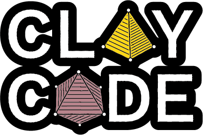

.. title:: Home

   
.. blank lines to space out heading

|
   
.. description of ClayCode

**ClayCode** generates clay mineral structures based upon their natural partially occupied unit cell compositions and assigns ClayFF force field parameters, generating all the input files ready for simulation with Gromacs software.

.. outline of docs

The ClayCode :ref:`User Guide <user_guide>` provides an overview on how use the package, with comprehensive information on the input and output files. For installing ClayCode and its dependencies see the :ref:`Installation Guide <installation>`. There are also practical step-by-step :ref:`Tutorials <tutorials>` using various clay types as examples. More detailed :ref:`technical documentation <API_docs>` is supplied for developers.

Source Code
===========
The source code is available on `GitHub`_.

**Report bugs and give suggestions** for future improvements and new features via an `issue`_.

**Have you added new functionality to the code, or assigned new clay unit cells?** Please share with the wider community by `forking this project`_ and submitting a `pull request`_. Learn more on how to contribute `here`_.

|Project Status: Active| |GitHub commit activity (branch)| |GitHub issues| |GitHub pull requests| |License: MIT|

.. _`GitHub`: https://github.com/Erastova-group/ClayCode/tree/main
.. _`issue`: https://github.com/Erastova-group/ClayCode/issues
.. _`forking this project`: https://github.com/Erastova-group/ClayCode/fork
.. _`pull request`: https://github.com/Erastova-group/ClayCode/pulls
.. _`here`: https://docs.github.com/en/get-started/quickstart/contributing-to-projects

.. |Project Status: Active| image:: https://www.repostatus.org/badges/latest/active.svg
   :target: https://www.repostatus.org/#active
.. |GitHub commit activity (branch)| image:: https://img.shields.io/github/commit-activity/m/Erastova-group/ClayCode
.. |GitHub issues| image:: https://img.shields.io/github/issues/Erastova-group/ClayCode
.. |GitHub pull requests| image:: https://img.shields.io/github/issues-pr/Erastova-group/ClayCode
.. |License: MIT| image:: https://img.shields.io/badge/License-MIT-yellow.svg
   :target: https://opensource.org/licenses/MIT

Citing ClayCode
================

ClayCode is developed by Hannah Pollak, Matteo Degiacomi and Valentina Erastova, University of Edinburgh, 2023.

ClayCode is published under the `MIT License`_.

.. _`MIT License`: https://github.com/Erastova-group/ClayCode/blob/main/LICENSE.txt

Please CITE us: HP, MTD, VE "ClayCode: setting up clay structures from simulation in Gromacs", DOI: XXX

.. toctree::
   :maxdepth: 1
   :hidden:
   
   Home <self>
   installation
   API_docs

.. toctree::
   :maxdepth: 1
   :caption: User Guide
   :hidden:
   
   ./user_guide/user_guide
   ./user_guide/data_files
   ./user_guide/input_files
   ./user_guide/output_files
   
.. toctree::
   :maxdepth: 1
   :caption: Tutorials
   :hidden:
   
   ./tutorials/tutorials.rst
   ./tutorials/montmorillonite
   ./tutorials/illite
   ./tutorials/pyrophylite
   ./tutorials/nontronite
   ./tutorials/fe_smectite
   ./tutorials/kaolinite
   ./tutorials/ldh
